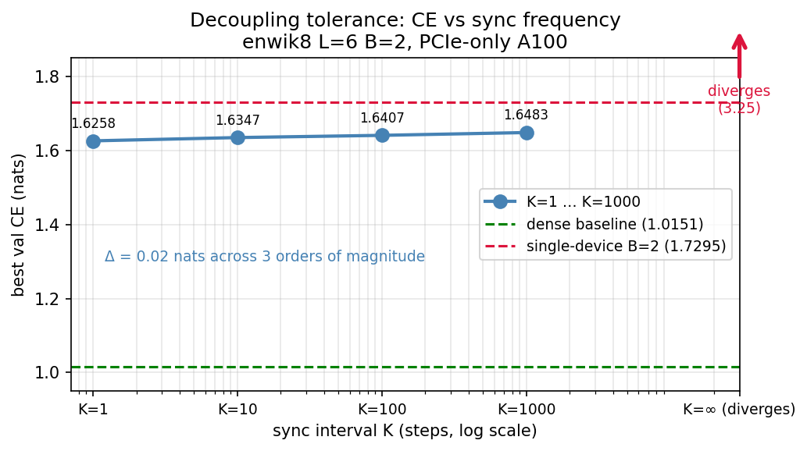

# DiffusionBlocks × nanoGPT

Port of DiffusionBlocks to Andrej Karpathy's nanoGPT. Independent implementation. The released code from Sakana is image-only; AR results aren't open-sourced. 

Mechanism: Language model partitioned into blocks by equi-probability, EDM preconditioning, target embedding noised, only the assigned block's layers run, denoising prediction, logits out.  

Results:
- Memory: 1628 -> 758 MD, 2 of 6 layers resident per step. Blocks don't need each other in forward / backward pass.
- Depth scaling: gap flat/shrinks L=6→12
- Quality (single block): best val CE 2.05 vs 1.46 baseline, real gap of ~0.6. Reduced to ~0.4 with clean-conditioning attention.
- Quality (composed multi-block inference): hard, unresolved. Composed model shows large quality cost. I introduced a fine-tuning method that moderates drift, but a residual remains. Cross-entropy also emerges as a degenerate method at low noise levels. Whether composition is viable on a different metric is left as future work.
- Ablation negative result: hypothesized the gap was an EDM weighting artifact. Negative result. The gap is structural at this scale, not a weighting bug.

6-layer causal GPT, Shakespeare-char, A100 GPU.

## Code

Two files hold all the changes from nanoGPT:

- [`model_dblock.py`](model_dblock.py) — Imports the original `model.py` and adds the diffusion logic on top. The whole file is the delta. Six `DBLOCK n/6` markers walk you through the key moves in order.
- [`train_dblock.py`](train_dblock.py) — Training loop adapted for the diffusion objective: EDM-weighted loss, σ curriculum, dual logging of EDM loss and val CE.

## Decoupled training across devices

Blocks independence suggests training on separate devices with no cross-block gradient flow. We tested this directly.

Two GPUs, one block each. Block weights (the transformer layers) are never communicated. Only the shared interface — token embed, pos embed, final LayerNorm, output head — is all-reduced every K steps. No automatic gradient sync.

The amortized network traffic at K=1000 is 9.71 KB per step vs 66.5 MB for standard DDP. 7000× less.

We swept K ∈ {1, 10, 100, 1000, ∞} on enwik8 L=6, 60k iterations. K=1 through K=1000 land within 0.02 CE of each other — the curve is essentially flat. Sync less, pay nothing.

K=∞ diverges. Best CE of 3.25 at iteration 2000, climbing to ~8 by the end. Shared interface is necessary. Carries consensus signal that keeps seperate denoising experts pointing at the same language distribution. Without it, they drift apart.

The open question is where the knee is. K=1000 is fine. K=∞ is not. Somewhere between them is a threshold worth finding.

---

If the flat K=1–1000 result holds at larger scale — bigger models, more blocks, slower interconnect — the mandatory-fabric assumption behind current AI concentration starts to bend. That's a big if. It's also a smaller if than it was before this experiment.
