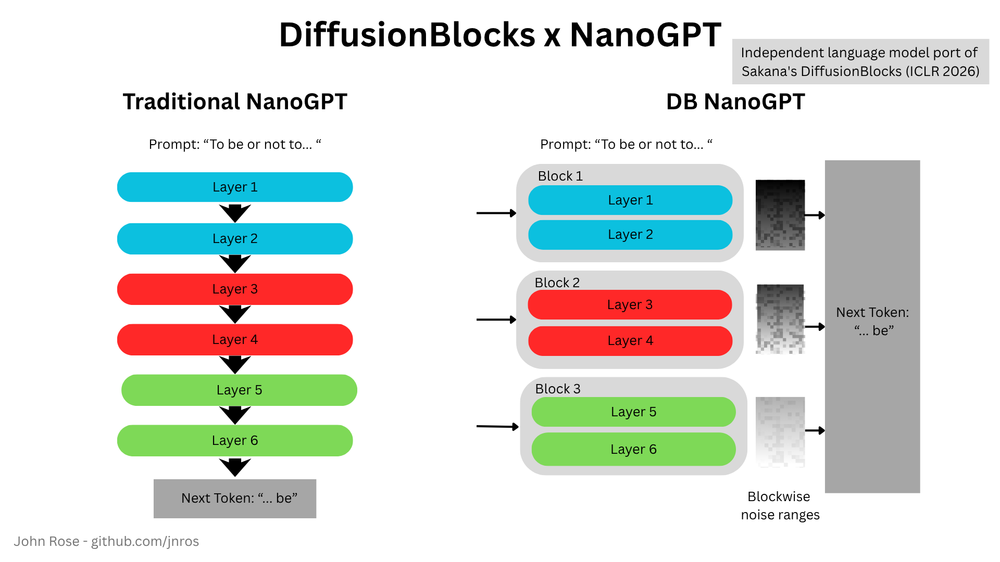
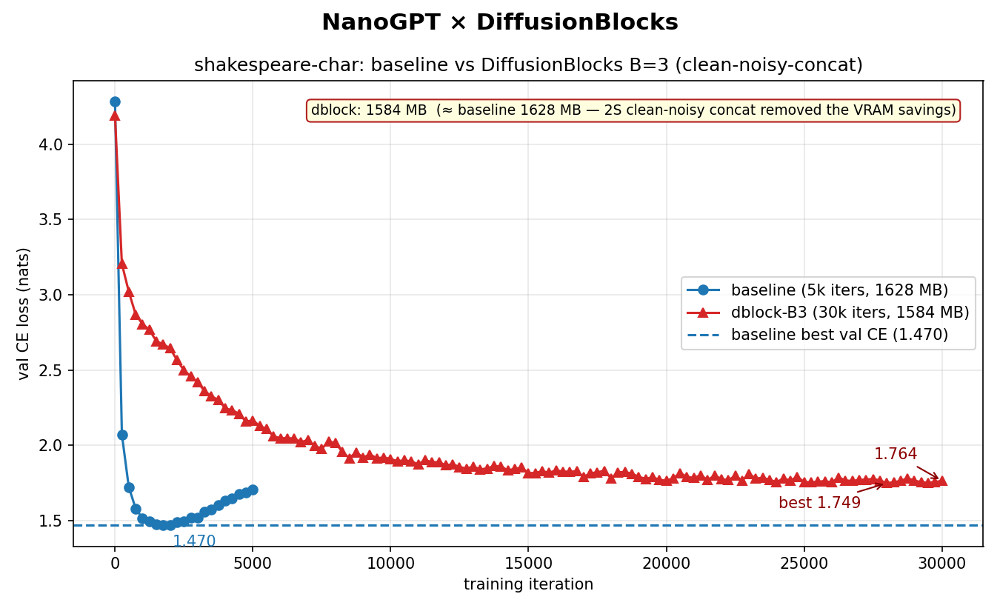
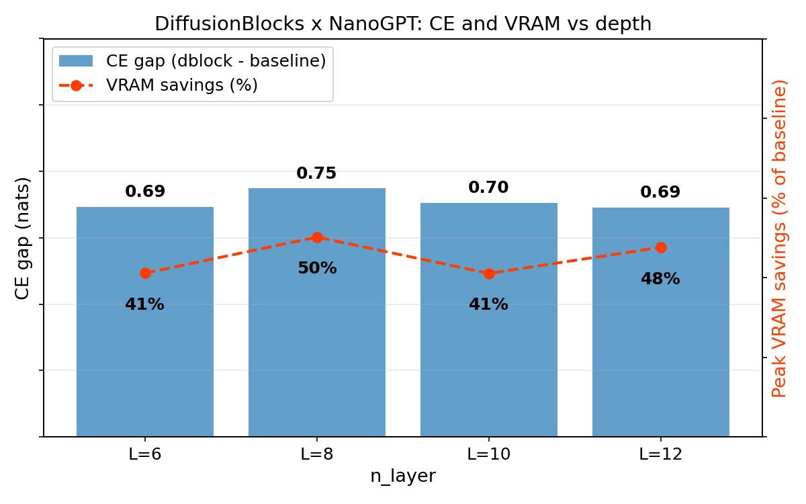
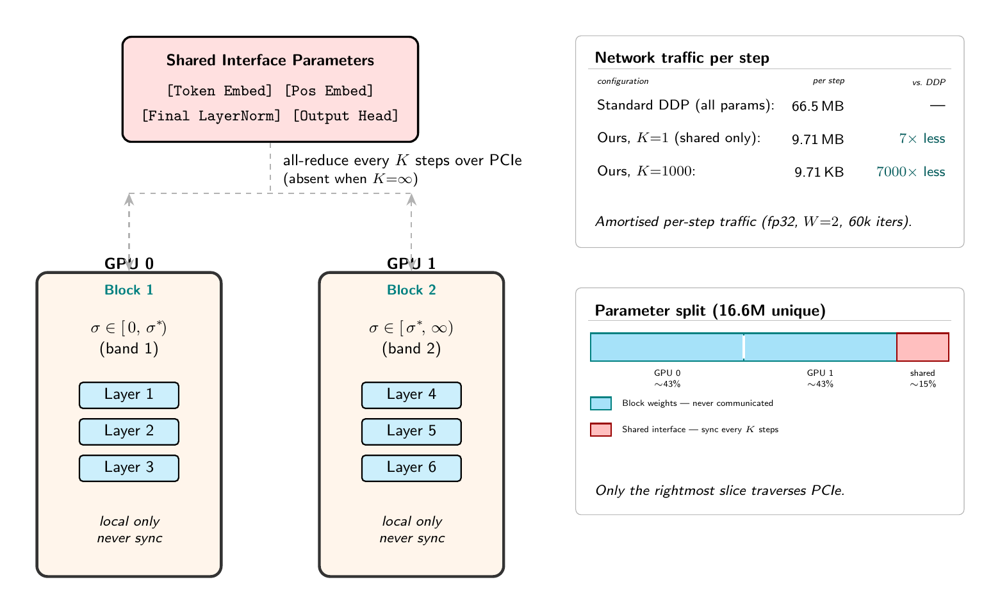
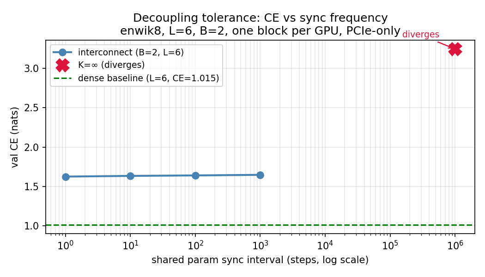
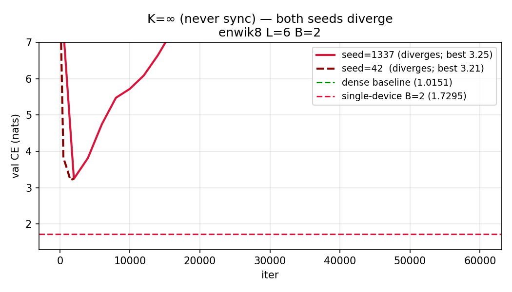

# DiffusionBlocks × nanoGPT

Independent language model port of Sakana's DiffusionBlocks (ICLR 2026). Applied to Andrej Karpathy's nanoGPT.

Autoregressive language model. EDM preconditioning, σ sampled from the equi-probability log-normal partition, target embedding noised, only the assigned block's layers run, denoising prediction, logits out.

Each block gets its own fresh noise sample at its assigned σ — not the output of the block before it. Each block has its own denoising objective. No backward gradient flows between blocks. Training moves from one monolith to a set of independent specialists.

The published Sakana repo implements only image classification; the AR language-model results in the paper aren't open-sourced. So I cloned Karpathy's nanoGPT (he's my sensei) and added diffusion where it don't belong.

6-layer causal GPT, Shakespeare-char, A100 GPU.

**Peak VRAM:** 1628 → 758 MB (2.16× reduction). Only 2 of 6 layers run per step on a single GPU. The bigger structural win: those 2 layers don't need the other 4 at all. They could be on a different machine, trained by a different team.

**Best val CE:** 1.46 (baseline) vs 2.05 (DiffusionBlocks). A real gap.

**Ablation:** hypothesized the gap was an EDM weighting artifact. Negative result. The gap is structural at this scale, not a weighting bug.

## Code

Two files hold all the changes from nanoGPT:

- [`model_dblock.py`](model_dblock.py) — 205 lines. Imports the original `model.py` and adds the diffusion logic on top. The whole file is the delta. Six `DBLOCK n/6` markers walk you through the key moves in order.
- [`train_dblock.py`](train_dblock.py) — 318 lines. Training loop adapted for the diffusion objective: EDM-weighted loss, σ curriculum, dual logging of EDM loss and val CE.

Everything else is unmodified Karpathy.

## Depth scaling

Does the CE gap widen or close as the model gets deeper? We ran enwik8 at L=6, 8, 10, 12 (n_embd=384) with matched iteration budgets.

Gap at L=6: 0.69. Gap at L=12: 0.61. It shrinks. No collapse, no instability. Many layer-wise training methods fail at scale; this one doesn't.

## Decoupled training across devices

The structural win from the implementation — blocks don't need each other during the forward pass — implies they could train on separate devices with no cross-block gradient flow. We tested this directly.

Two GPUs, one block each. Block weights (the transformer layers) are never communicated. Only the shared interface — token embed, pos embed, final LayerNorm, output head — is all-reduced every K steps. No DDP wrapper, no automatic gradient sync.

The amortized network traffic at K=1000 is 9.71 KB per step vs 66.5 MB for standard DDP. 7000× less.

We swept K ∈ {1, 10, 100, 1000, ∞} on enwik8 L=6, 60k iterations. K=1 through K=1000 land within 0.02 CE of each other — the curve is essentially flat. Sync less, pay nothing.

K=∞ diverges. Best CE of 3.25 at iteration 2000, climbing to ~8 by the end. These specialists still need a foreman: the shared interface is load-bearing. It carries the consensus signal that keeps two independently-trained denoising experts pointing at the same language distribution. Cut it entirely and they drift apart.

The open question is where the knee is. K=1000 is fine. K=∞ is not. Somewhere between them is a threshold worth finding.

---

If the flat K=1–1000 result holds at larger scale — bigger models, more blocks, slower interconnect — the mandatory-fabric assumption behind current AI concentration starts to bend. That's a big if. It's also a smaller if than it was before this experiment.
